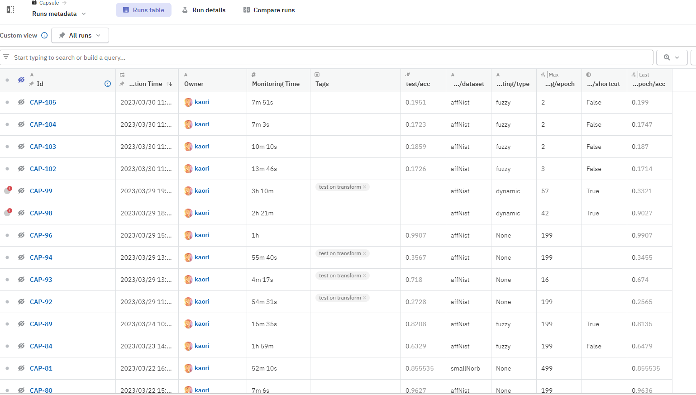

# Encapsulate Capsule Layers


## prequisite
- Python=3.9
- CUDA: 11.2/11.3
- Pytorch framwork: 1.12.1, pytorch-lightning
- Others: numpy, opencv, scipy
- dashboard: neptune ai (for training), gradio (for testing)
## Environments Settings
- Install [Anaconda](https://www.anaconda.com/)
- create a new environment:
```
conda create --name=Capsule python=3.9
conda activate Capsule
```
- Install dependencies: 
```
sh env-create.sh
```
#
We reimplement Capsule Layers in 3 files: Routing.py, CapsuleLayer.py, and Model.py
- Routing.py: Implement 3 routing methods: [EM](Capsules/Routing.py#L23), [Dynamic](Capsules/Routing.py#84), and [Fuzzy](Capsules/Routing.py#L126). Algorithm's details are provided in [pdf](Algorithm.pdf)
- CapsuleLayer.py: Implement [2D ConvCaps](Capsules/CapsuleLayer.py#L70), [Primary Capsules](Capsules/CapsuleLayer.py#L29), [Shortcut Layers](Capsules/CapsuleLayer.py#L260), and [Efficient DepthWise Capsule](Capsules/CapsuleLayer.py#L319).


- Model.py: Using above implemented modules to build a [CapsuleNetwork](Capsules/Model.py#L97), [Shortcut Architecture](Capsules/Model.py#L181), and [Efficient CapsuleNetwork](Capsules/Model.py#L254) (recommended).

#
## Training Interface
Examples of training Capsule Network can be found in [ReadDataset.py](Capsules/ReadDataset.py) and [main.py](Capsules/main.py), we config hyper-parameters in [config.yaml](Capsules/config.yaml) file

- ReadDataset.py: there are five datasets have been pre-defined: Mnist, [affNist](Capsules/ReadDataset.py#L153), Fashion Mnist, SVHN, and [smallNorb](Capsules/ReadDataset.py#L14)
- main.py: Our main module is [CapsuleModel](Capsules/main.py#L80) that based on [pytorch-lightning](https://lightning.ai/pages/open-source/) and logged by [neptune-ai](https://neptune.ai/)



```
python Capsules/main.py
```
## Configuration (Config file)
