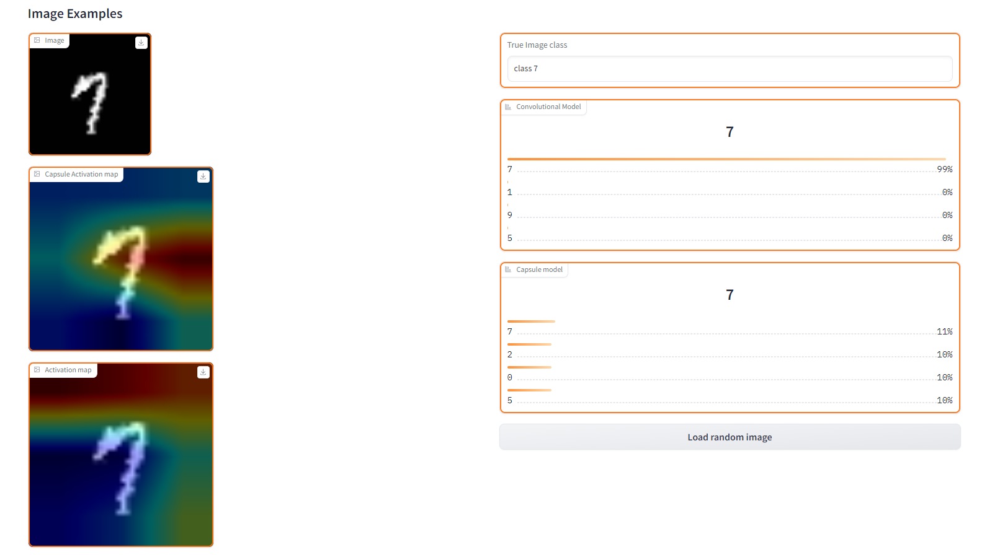

# Encapsulate Capsule Layers


## prequisite
- Python=3.9
- CUDA: 11.2/11.3
- Pytorch framwork: 1.12.1, pytorch-lightning
- Others: numpy, opencv, scipy
- dashboard: neptune ai (for training), gradio (for testing)
## Environments Settings
- Install [Anaconda](https://www.anaconda.com/)
- create a new environment:
```
conda create --name=Capsule python=3.9
conda activate Capsule
```
- Install dependencies: 
```
sh env-create.sh
```
#
We reimplement Capsule Layers in 3 files: Routing.py, CapsuleLayer.py, and Model.py
- Routing.py: Implement 3 routing methods: [EM](Capsules/Routing.py#L23), [Dynamic](Capsules/Routing.py#84), and [Fuzzy](Capsules/Routing.py#L125). Algorithm's details are provided in [pdf](Algorithm.pdf)
- CapsuleLayer.py: Implement [2D ConvCaps](Capsules/CapsuleLayer.py#L55), [Primary Capsules](Capsules/CapsuleLayer.py#L12), [Shortcut Layers](Capsules/CapsuleLayer.py#L173), and [Efficient DepthWise Capsule](Capsules/CapsuleLayer.py#L304).


- Model.py: Using above implemented modules to build a [CapsuleNetwork](Capsules/Model.py#L84), [Shortcut Architecture](Capsules/Model.py#L168), and [Efficient CapsuleNetwork](Capsules/Model.py#L254) (recommended).

#
## Training Interface
Examples of training Capsule Network can be found in [ReadDataset.py](Capsules/ReadDataset.py) and [main.py](Capsules/main.py), we config hyper-parameters in [config.yaml](Capsules/config.yaml) file

- ReadDataset.py: there are five datasets have been pre-defined: Mnist, [affNist](Capsules/ReadDataset.py#L153), Fashion Mnist, SVHN, and [smallNorb](Capsules/ReadDataset.py#L14)
- main.py: Our main module is [CapsuleModel](Capsules/main.py#L80) that based on [pytorch-lightning](https://lightning.ai/pages/open-source/) and logged by [neptune-ai](https://neptune.ai/)


```
python Capsules/main.py
```
#

## Testing Interface
We deploy (demo) our model using [Gradio](https://gradio.app/), which supports  activation map visualization and see the results
```
python Capsules/Interface.py
```


#
## list of papers
- [EM routing](https://openreview.net/pdf?id=HJWLfGWRb)
- [Dynamic routing](https://arxiv.org/pdf/1710.09829.pdf)
- [Shortcut routing](https://search.ieice.org/bin/pdf_link.php?category=A&fname=e104-a_8_1043&lang=E&year=2021)

## list of implementation
- [gram-ai/capsule-networks](https://github.com/gram-ai/capsule-networks)

- [danielhavir/capsule-network](https://github.com/danielhavir/capsule-network)

- [XifengGuo/CapsNet-Pytorch](https://github.com/XifengGuo/CapsNet-Pytorch)

- [lidq92/pytorch-capsule-networks](https://github.com/lidq92/pytorch-capsule-networks)

- [jindongwang/Pytorch-CapsuleNet](https://github.com/jindongwang/Pytorch-CapsuleNet)