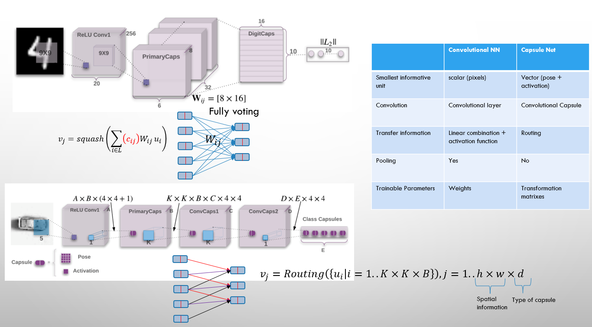
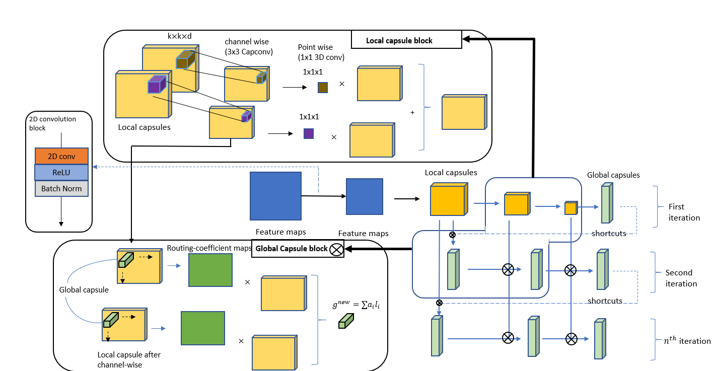

# Encapsulate Capsule Layers

## prequisite
- Python=3.9
- CUDA: 11.2/11.3
- Pytorch framwork: 1.12.1
- 
#
We reimplement Capsule Layers in 3 files: Routing.py, CapsuleLayer.py, and Model.py
- Routing.py: Implement 3 routing methods: [EM](https://github.com/Ka0Ri/Capsule-Network/blob/Encapsulate/Capsules/Routing.py#L16), [Dynamic](https://github.com/Ka0Ri/Capsule-Network/blob/Encapsulate/Capsules/Routing.py#70), and [Fuzzy](https://github.com/Ka0Ri/Capsule-Network/blob/Encapsulate/Capsules/Routing.py#L105). Details of algorithms are provided in [pdf](Algorithm.pdf)
- CapsuleLayer.py: Implement [2D ConvCaps](), [Primary Capsules](), and [Shortcut Layers]().

- Model.py: Using those implemented module to build a CapsuleNetwork.

#

## list of papers
- [EM routing](https://openreview.net/pdf?id=HJWLfGWRb)
- [Dynamic routing](https://arxiv.org/pdf/1710.09829.pdf)
- [Shortcut routing](https://search.ieice.org/bin/pdf_link.php?category=A&fname=e104-a_8_1043&lang=E&year=2021)

## list of implementation
- [gram-ai/capsule-networks](https://github.com/gram-ai/capsule-networks)

- [danielhavir/capsule-network](https://github.com/danielhavir/capsule-network)

- [XifengGuo/CapsNet-Pytorch](https://github.com/XifengGuo/CapsNet-Pytorch)

- [lidq92/pytorch-capsule-networks](https://github.com/lidq92/pytorch-capsule-networks)

- [jindongwang/Pytorch-CapsuleNet](https://github.com/jindongwang/Pytorch-CapsuleNet)